# TEÓRICA 6: Arquitetura

O desenvolvimento da arquitetura de um sistema é importante, pois permite minimizar a sua complexidade e as suas
vulnerabilidades na hora da implementação.

## Arquiteturas de segurança centralizadas

Tem como beneficios:

- Facilidade de projeção e construção;
- A informação protegida pode ser acedida de um modo mais eficiente e menos custoso;

Desvantagens:

- Caso a segurança seja violada, todo o sistema fica comprometido;

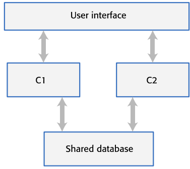

*Fig.1 Arquitetura centralizada*

## Arquiteturas de segurança distribuída

Tem como beneficios:

- Caso a segurança seja violada numa localização, os restantes pontos do sistema não são afetados;

Desvantagens:

- A informação protegida pode ser acedida de um modo menos eficiente e mais custoso;

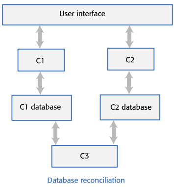

*Fig.2 Arquitetura distribuída*

## Segurança vs Usabilidade

Podemos atingir um nivel de segurança bom projetando uma proteção no nosso sistema com um conjunto de **camadas**. Cada
uma dessas camadas envolve um nível de autenticação o que, por outro lado, afetaria a usabilidade da aplicação, pois o
utilizador final terá de passar por todas essas camadas de segurança.

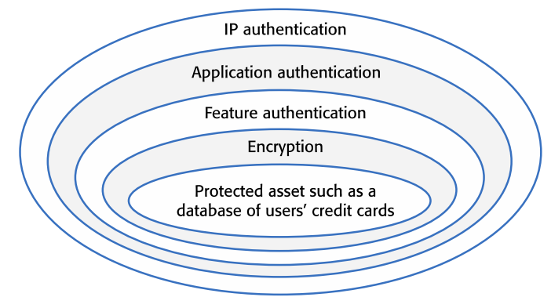

*Fig.3 Camadas de segurança*

De modo a ter um sistema com uma melhor usabilidade temos que:

- Minimizar o número de camadas de segurança;
- Minimizar o número de autenticações necessárias;

## Exemplos de relações entre componentes:

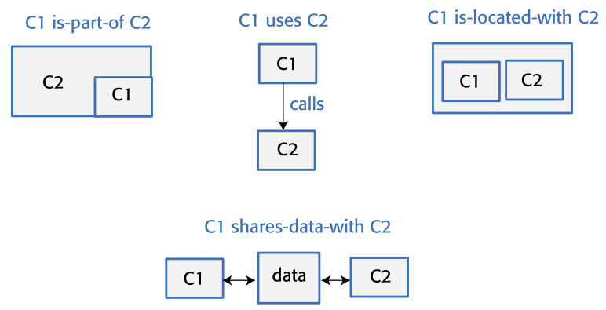

## Preocupações transversais

Preocupações transversais são preocupações que são sistemicas, que afetam todo o sistema.

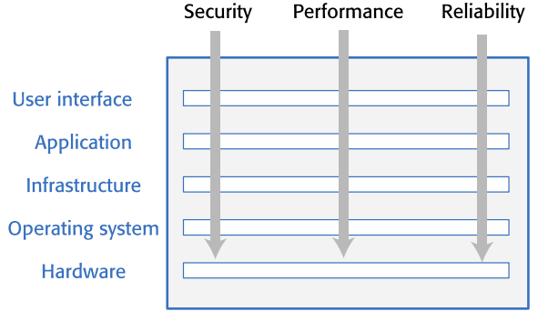

*Fig.4 Preocupações transversais*

## Exemplo genérico de uma arquitetura de uma aplicação web-based

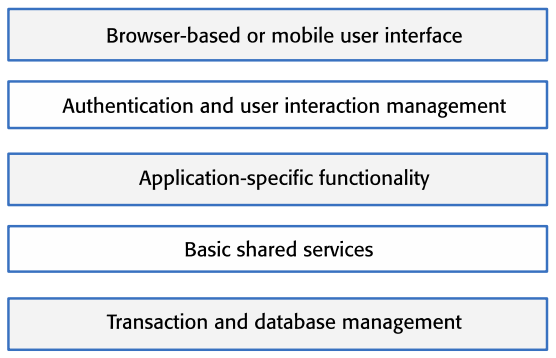

## Arquitetura cliente-servidor

A funcionalidade do sistema é organizada por serviços, onde cada serviço é feita num servidor em separado. Os clientes
são os utilizadores destes serviços e acedem aos servidores para os poderem utilizar.

Vantagens:

- Maior distributividade;
- Maior escalabilidade;

Desvantagens:

- Maior complexidade;
- Cada serviço torna-se mais suscetival a ataques e a falhas;
- Desempenho torna-se imprevisivel;

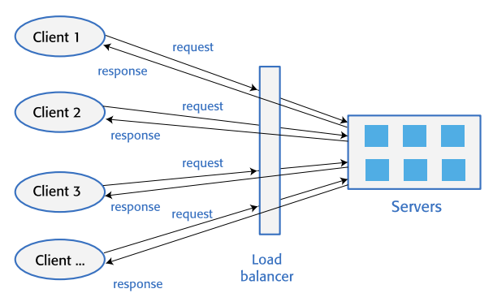

*Fig.5 Arquitetura cliente-servidor*

## Base de dados

Os 2 tipos de base de daos mais usados são:

- Base de dados relacional, onde os dados são organizados em tabelas;
- NoSQL, onde os dados são mais flexiveis sendo organizados por utilizador;

# TEÓRICA 9: Testagem de Software

Testagem de ‘software’ é o processo onde o programa nós executamos o programa com dados que simulam as entradas de um
utilizador comum. Após isso, observamos o comportamento para ver se o nosso programa faz o suposto.

- Caso passe nos testes, o programa está correto.
- Caso não passe, estamos de encontro com um 'bug'.

## Tipos de bugs

Existe dois tipos:

- Erros de programação: existem erros na implementação do pedido;
- Erros de compreensão: existe uma certa dificuldade em entender o pedido, ou desconhece alguns detalhes daquilo que ele
  é suposto fazer;

## Tipos de testes

Existem quatro tipos comuns de teste:

- Teste funcional:
    - Teste de sistema;
    - Teste de ferramentas;
- Teste de utilizador;
- Teste de performance;
- Teste de segurança;

## Automatação de testagem

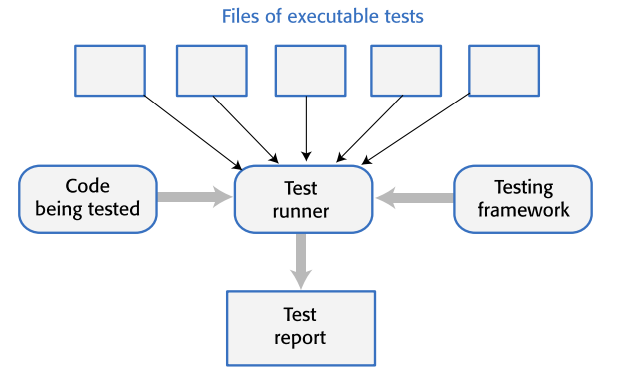

*Fig.1: Diagrama de automatação de testagem*

Normalmente organiza-se a automatação de testes em três partes:

- Organização de testes;
- Execução de testes;
- Análise de resultados;

Nota: Na automatação de testes, a testagem de ferramentas e feita diretamente na API e não na ‘interface’ gráfica.

## Desenvolvimento guiado por testes

Desenvolvimento guiado por testes ou (Test Driven Development) é um processo de desenvolvimento de ‘software’ onde os
testes são escritos antes do código. O objetivo é escrever testes que falhem, e depois escrever o código para que os
testes passem.

Benefícios:

- Aumenta a confiança no código;
- Aumenta a qualidade do código;
- ‘Debugging’ mais fácil;

Desvantagens:

- Os programados ficam mais focados em passar nos testes do que em escrever código de qualidade e a estrutura do mesmo;

## Testes de segurança

Testes de segurança visam encontrar vulnerabilidades no ‘software’ que possam ser exploradas por um atacante.

### Testes de segurança baseados em risco

Testes de segurança baseados em risco (ou Risk Based Testing) é um processo onde os testes são baseados no risco de uma
aplicação.

#### Exemplos

Alguns exemplos são:

- Portas HTTP inutilizadas, porém abertas;
- Falhas de autenticação;
- ‘Cookies’ de acesso são revelados para um potencial atacante;
- Chaves de encriptação divulgadas para um potencial atacante;

#### Perguntas de outros anos
```md
- Explique porque os Testes de Software apenas podem detetara presença de erros, não a sua ausência.

A realização de um teste exaustivo de um programa, em que todos os possíveis inputs são testados é praticamente impossível ou irrealista.
Isto significa que quando não são detetados erros não significa que estes não existem, apenas que não foram revelados pelos inputs testados.
Pelo contrário; a existência de erros, será a manifestação da existência de defeitos no programa.
```
## Revisões de código

Revisões de código envolvem uma ou mais pessoas que analisam o código de um programa para encontrar possiveís problemas.
Caso sejam encontrados erros, será responsabilidade do **desenvolvedor** resolvê-lo.

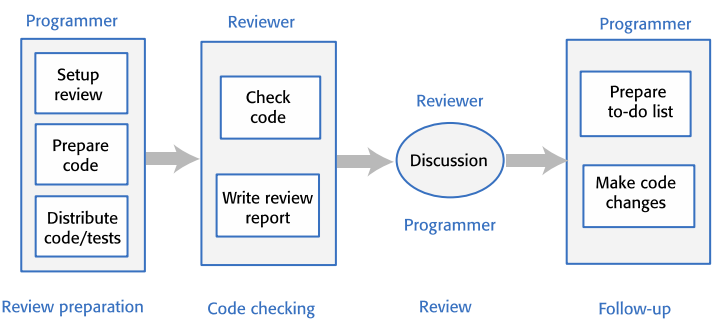

*Fig.2: Diagrama de revisão de código*

# TEÓRICA 10: Evolução de Software

Alterações no ‘software’ são inevitáveis poís são parte do processo de evolução e melhoria do mesmo. O problema chave
encontra-se na gestão dessas mudanças nos sistemas existentes.

A evolução é importante pois:

- Erros devem ser reparados;
- Ambiente de trabalho é alterado constantemente;
- O desempenho e/ou fiabilidade do 'software' pode ser melhorada;
- Maior parte das empresas está mais virada para uma evolução do ‘software’ existente, do que o desenvolvimento de um
  novo.

Existem três estados no ciclo de vida de um sistema de ‘software’ após o seu desenvolvimento:

- Evolução: Neste estado ele encontra-se operacional ainda, porém novos requisitos para ser implementados são
  propóstos;
- Manutenção: Neste estado o sistema encontra-se operacional, porém não há novos requisitos para serem implementados e
  qualquer mudança é apenas para o manter operacional;
- Abandono: Neste estado o sistema pode encontrar-se operacional ou não, porém não há mais ninguém responsável por
  o manter.

## Processos de Evolução

Os processos de evolução depende de:

- Tipo de software que está a ser mantido;
- Processos do desenvolvimento utilizados;
- Experiência e habilidades das pessoas envolvidas;

Nota: As propostas de mudança são o guia para a evolução do ‘software’.

### Métodos ágeis de evolução

Métodos ágeis são baseados no desenvolvimento incremental então a transição do desenvolvimento para a evolução é
bastante suave (contínua).

### Problemas na entrega

Onde a equipa de desenvolvimento usou uma abordagem agil, mas a equipa de evolução não está familiarizada com métodos
ágeis e prefere uma abordagem baseada no planeamento

## Sistemas herdados

Sistemas herdados baseam-se em sistemas antigos desenvolvidos numa tecnologia que não são mais usadas no
desenvolvimento dos mais recentes, e podem também ser dependentes de 'hardware' antigo.

### Componentes de sistemas herdades

- Hardware do sistema;
- Suporte de ‘software’;
- Aplicações de ‘software’;
- Aplicações de dados;

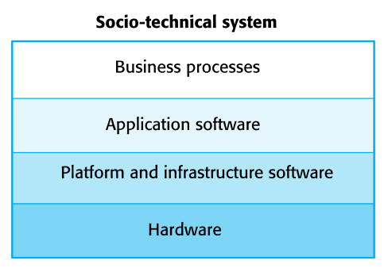

** Fig.1: Diagrama de componentes de sistemas herdados **

### Substituição de componentes

A substituição destes sistemas pode ser arriscada em nível de segurança e custosa para os negócios continuarem a
utilizá-los e:

- Usam linguagens de programação quase obsoletas;
- Têm uma documentação inadequada;
- A estrutura do sistema é degradada;

## Avaliação do valor de negócio

Devem ser tomados em conta os seguintes fatores:

- O cliente final do sistema;
- Os clientes do negócio;
- Gestores da tecnologia;
- Gestores de negócio;

Problemas na avaliação do valor de negócio:

- Caso o sistema é usado apenas ocasionalmente ou por um número baixo de pessoas, então possivelmente tem um valor de
  negócio baixo;
- Um sistema pode ter um valor baixo de negócio caso force o uso de processos de negócio ineficientes;
- Caso o sistema não for fiável e os problemas afetarem diretamente os clientes do negócio, então o sistema tem um valor
  de negócio baixo;

Existem três modos de avaliação do valor de negócio:

- Avaliação do valor de negócio do sistema;
- Avaliação do ambiente de negócio;
- Avaliação da aplicação do sistema;

## Manutenção de sistemas

Manutenção é o ato de modificar o programa após ele já tenha começado a ser utilizado. As mudanças são implementadas
modificando componentes existentes e/ou adicionando novos ao sistema.

### Tipos de manutenção

Temos três tipos de manutenção:

- Manutenção de avaria;
- Manutenção de adaptação;
- Adicionação de uma funcionalidade ou modificação;

Nota: Normalemente os custos da manutenção são maiores que os custos do desenvolvimento.

## Reengenharia de Software

Consiste na restruturaçào e reorganização de um sistema de ‘software’ existente, para melhorar a sua qualidade e/ou a
sua manutenção sem modificar a sua funcionabilidade.

### Vantagens

- Risco reduzido;
- Custo reduzido;

## Más práticas no código

Exemplos de más práticas:

- Código duplicado;
- Métodos muito longos;
- Switch case com muitos casos;
- Algomeração de dados;

# Teórica 11: DevOps

**DevOps** são práticas que visam a colaboração entre as equipas de **desenvolvimento** e de **operações**, para que o
‘software’
seja entregue e operacionalizado de modo mais rápido e eficiente.

Existem três fatores que levam para o desenvolvimento e adoção de DevOps:

- Melhoria da comunicação e colaboração entre equipas de desenvolvimento e operações, permitindo que os problemas sejam
  detetados e resolvidos rapidamente.
- Automatização de tarefas repetitivas, como implantações, testes e monitoramento, para aumentar a eficiência e diminuir
  erros humanos.
- Mudanças na mentalidade e cultura da empresa, para valorizar a experimentação, a inovação e a melhoria contínua.

Benefícios da adoção de DevOps:

- Entrega de ‘software’ mais rápida;
- Risco reduzido;
- Reparação mais rápida;
- Equipas mais produtivas;

## Gestão de código

'Code management' é um conjunto de práticas suportadas por 'software' usadas para gerir a base de código em evolução. É
necessária esta gestão para asegurar que futuras mudanças feitas por diferentes desenvolvedores não interferem entre si.

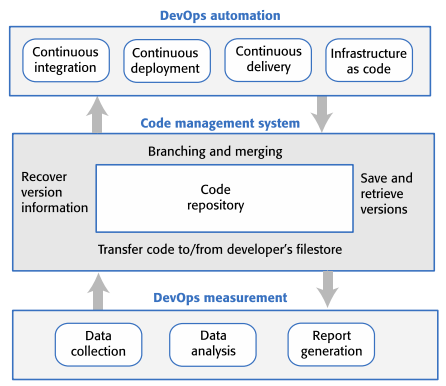

*Fig.1: Codemanagement e DevOps*

'Code management' fornece um conjunto de ferramentas para:

- Melhor controlo de versões;
- Desenvolvimento paralelo entre os envolvidos;
- Recuperação de versões antigas;

Beneficios de 'code management' distribuído:

- Resiliência;
- Velocidade;
- Flexibilidade;

## Integração de sistema

Integração de sistema (ou 'System integration') é o processo de combinar componentes de 'software' num sistema maior.

Algumas destas atividades são:

- Linkagem de bibliotecas;
- Verificar se serviços externos usados encontram-se operacionais;
- Configuração da base de dados com a estrutura apropriada;

### Integração continua

Signfica que a versão integrada no sistema é criada e testada todavez que uma mudança é mandada para o repositorio
partilhado do sistema.

### 'Breaking the build'

Acontece quando uma mudança introduzida no repositório partilhado no sistema quebra o mesmo.

## 'Deployment pipeline'

A 'deployment pipeline' é um conjunto de etapas que o 'software' passa antes de ser entregue ao cliente. Cada etapa é
executada automaticamente e o 'software' só é entregue ao cliente se todas as etapas forem bem sucedidas.

Beneficios:

- Custos reduzidos;
- Resolução de problemas mais rápida;
- Opinião do cliente mais rápida;

## Código por infrastrutura

Visa invés de atualizar o ‘software’ nos servidores da empresa manualmente, fazer um processo de modo automático
usando um modelo de infrastrutura escrito numa linguagem num formato que possa ser processado pelo computador.

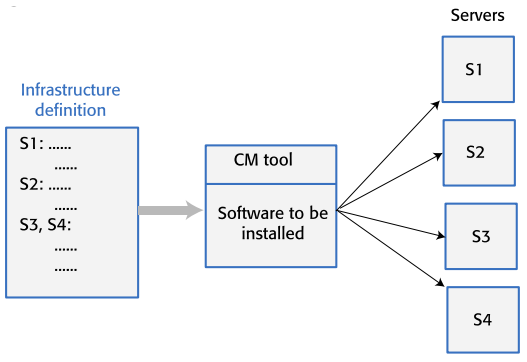

*Fig.2: Código por infrastrutura*

Beneficios:

- Caso seja mudado um serviço, o código é alterado e o mesmo é aplicado automatica e rapidamente em todos os servidores;
- O ambiente de teste é o mesmo que o ambiente de produção;
- Baixo risco quando mudanças de infrastrutura são implementadas;
- Os custos da gestão do sistema são reduzidos;

